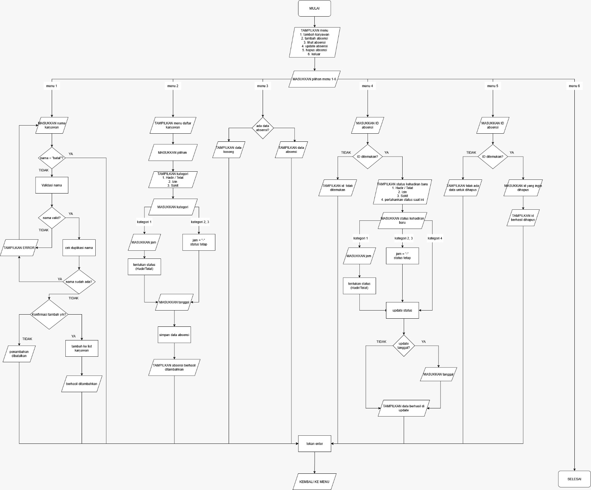

# Sistem-Management-Data-Absensi-Kelas-Berbasis-Python

#**Deskripsi Program**

Program Absensi Karyawan Toko Elektronik Berbasis Python merupakan sebuah aplikasi sederhana yang dirancang untuk mencatat dan mengelola data kehadiran karyawan yang bekerja di toko elektronik, seperti toko handphone, komputer, maupun peralatan elektronik lainnya. Aplikasi ini bertujuan membantu pemilik toko atau bagian administrasi dalam melakukan pencatatan kehadiran karyawan secara sistematis dan terkomputerisasi.

Melalui program ini, informasi absensi yang meliputi ID karyawan, nama karyawan, tanggal kehadiran, serta status kehadiran (hadir, telat, izin, dan alfa) dapat diinput, disimpan, serta ditampilkan kembali dengan mudah. Dengan demikian, proses absensi menjadi lebih efisien, tertata, dan dapat meminimalkan kesalahan yang sering terjadi pada pencatatan manual.
#**Konsep Program**

1. Bentuk dan Mekanisme Program

   Program dikembangkan berbasis console (teks) dengan menggunakan bahasa pemrograman Python. Interaksi antara pengguna dan sistem dilakukan melalui menu yang ditampilkan pada layar. Program berjalan secara berulang dan akan berhenti ketika pengguna memilih opsi keluar.

2. Pengelolaan Data

   Data absensi karyawan disimpan menggunakan struktur data list dan dictionary. Setiap data absensi mencakup ID karyawan, nama karyawan, tanggal absensi, dan status kehadiran. Penggunaan struktur data ini memudahkan proses pengolahan data seperti pencarian, pengubahan, dan penampilan informasi absensi.

3. Sistem Menu
   
    Sistem menu pada program ini menyediakan menu utama yang terdiri dari tambah absensi karyawan, melihat data absensi, mengubah (update) data absensi, menghapus data absensi, serta menu keluar. Seluruh menu dijalankan menggunakan perulangan (looping), sehingga pengguna dapat mengakses dan mengelola data absensi secara berulang tanpa harus menjalankan ulang program

4. Penerapan Kondisional

   Struktur kondisional digunakan untuk menentukan status kehadiran, memeriksa validitas pilihan menu, serta menangani kondisi tertentu seperti data absensi yang belum tersedia atau ID karyawan yang tidak ditemukan.

5. Penggunaan Prosedur dan Fungsi
   
   Setiap fitur utama diimplementasikan dalam bentuk fungsi atau prosedur terpisah, seperti fungsi untuk menginput absensi, menampilkan data, dan melakukan rekap absensi. Pendekatan ini membuat program lebih terstruktur, mudah dipahami, dan fleksibel untuk dikembangkan.

6. Validasi Tanggal Absensi

    Program menerapkan validasi tanggal untuk memastikan format tanggal yang dimasukkan benar, misalnya menggunakan format YYYY-MM-DD. Validasi dilakukan dengan memeriksa apakah tanggal yang diinput sesuai format dan merupakan tanggal yang valid pada kalender. Jika format salah atau tanggal tidak valid, sistem akan menampilkan pesan kesalahan dan meminta pengguna menginput ulang tanggal.

7. Validasi Jam Absensi

    Program menerapkan validasi jam untuk memastikan format waktu sesuai, misalnya HH:MM dengan sistem 24 jam. Selain memeriksa format, jam absensi juga digunakan untuk menentukan status kehadiran karyawan. Contohnya:

    Datang ≤ 08:00 → Hadir

    Datang > 08:00 → Telat

    Jika format jam tidak sesuai, sistem akan meminta pengguna memasukkan ulang jam absensi.

8. Penanganan Kesalahan (Exception Handling)

    Exception handling diterapkan untuk mengantisipasi kesalahan, seperti kesalahan input, kesalahan konversi data, atau kegagalan saat membaca file. Dengan adanya penanganan kesalahan, program menjadi lebih stabil dan tidak langsung berhenti ketika terjadi error.
8. Output Program

   Hasil keluaran program ditampilkan dalam bentuk tabel sederhana yang berisi data absensi karyawan toko elektronik. Selain itu, program juga menyediakan rekap jumlah kehadiran seperti hadir, telat, izin, dan alfa sebagai bahan evaluasi kedisiplinan karyawan.
## Flowchart
!
## Pseucode

```
PROGRAM SistemAbsensiKaryawan

DEKLARASI:
    KARYAWAN ← daftar string (awalnya: ["Akmalu", "Khansa", "Hedi", "Hasna", "Mutty"])
    absensi_data ← daftar dictionary (kosong awalnya)
    id_counter ← 1 (untuk ID otomatis)

FUNGSI validasi_nama(nama):
    JIKA nama kosong ATAU panjang trim(nama) < 2
        RETURN (FALSE, "Nama minimal 2 karakter dan tidak boleh kosong!")
    UNTUK setiap karakter c di trim(nama):
        JIKA c BUKAN huruf atau spasi:
            RETURN (FALSE, "Karakter '" + c + "' tidak diizinkan!")
    RETURN (TRUE, trim(nama))

FUNGSI validasi_jam(jam_str):
    Coba:
        Ganti ':' dengan '.' → jam_str
        Pisahkan berdasarkan '.' → [jam, menit]
        JIKA jumlah bagian ≠ 2 → RETURN NULL
        Konversi jam dan menit ke integer
        JIKA 0 ≤ jam ≤ 23 DAN 0 ≤ menit ≤ 59:
            RETURN format "HH.MM"
        SELAINNYA: RETURN NULL
    KECUALI error:
        RETURN NULL

FUNGSI validasi_tanggal(tgl_str):
    Coba:
        Pisahkan '-' → [hari, bulan, tahun]
        JIKA jumlah bagian ≠ 3 → RETURN NULL
        Konversi ke integer
        JIKA hari∉[1..31] ATAU bulan∉[1..12] ATAU tahun∉[2000..2100] → RETURN NULL
        JIKA hari > hari_maks(bulan, tahun) → RETURN NULL
        RETURN format "DD-MM-YYYY"
    KECUALI error:
        RETURN NULL

FUNGSI tentukan_status_otomatis(jam_str):
    Coba:
        Konversi jam_str (format HH.MM) ke float
        JIKA nilai ≤ 8.00 → RETURN "hadir"
        SELAINNYA → RETURN "telat"
    KECUALI error:
        RETURN "telat"

PROSEDUR tampilkan_header():
    CETAK "=" * 65
    CETAK "          SISTEM ABSENSI KARYAWAN"
    CETAK "=" * 65

PROSEDUR tampilkan_karyawan():
    CETAK "\nDaftar Karyawan:"
    JIKA KARYAWAN kosong:
        CETAK "  ℹ️  Belum ada data karyawan."
        RETURN
    UNTUK i = 1 sampai panjang(KARYAWAN):
        CETAK "  " + i + ". " + KARYAWAN[i-1]

FUNGSI input_pilihan_karyawan():
    LAKUKAN:
        tampilkan_karyawan()
        JIKA KARYAWAN kosong:
            CETAK "❌ Tidak ada karyawan terdaftar!"
            RETURN NULL
        INPUT pilih (integer)
        JIKA 1 ≤ pilih ≤ panjang(KARYAWAN):
            RETURN KARYAWAN[pilih-1]
        SELAINNYA:
            CETAK "❌ Input tidak valid!"
    SAMPAI valid

FUNGSI input_kategori_absensi():
    CETAK "[+] PILIH STATUS KEHADIRAN"
    CETAK "  1. Hadir / Telat   → Input jam wajib"
    CETAK "  2. Izin            → Tanpa jam"
    CETAK "  3. Sakit           → Tanpa jam"
    LAKUKAN:
        INPUT pilih
        JIKA pilih == "batal": RETURN NULL
        JIKA pilih ∈ {"1","2","3"}:
            RETURN mapping[pilih]  // 'otomatis', 'izin', 'sakit'
        SELAINNYA: CETAK "❌ Pilihan tidak valid!"
    SAMPAI valid

FUNGSI input_jam_absen():
    LAKUKAN:
        INPUT jam
        JIKA jam == "batal": RETURN NULL
        jam_valid ← validasi_jam(jam)
        JIKA jam_valid ≠ NULL: RETURN jam_valid
        SELAINNYA: CETAK "❌ Format jam tidak valid!"
    SAMPAI valid

FUNGSI input_tanggal_absen():
    LAKUKAN:
        INPUT tanggal
        JIKA tanggal == "batal": RETURN NULL
        tgl_valid ← validasi_tanggal(tanggal)
        JIKA tgl_valid ≠ NULL: RETURN tgl_valid
        SELAINNYA: CETAK "❌ Format tanggal tidak valid!"
    SAMPAI valid

FUNGSI input_id_valid(prompt, data_list):
    LAKUKAN:
        INPUT id_input
        JIKA id_input == "batal": RETURN NULL
        id_cari ← konversi ke integer
        JIKA ada record di data_list dengan record.id == id_cari:
            RETURN id_cari
        SELAINNYA: CETAK "❌ ID tidak ditemukan!"
    SAMPAI valid

PROSEDUR tambah_karyawan():
    tampilkan_header()
    CETAK "[+] TAMBAH KARYAWAN BARU"
    LAKUKAN:
        INPUT nama
        JIKA nama == "batal": CETAK "❌ Dibatalkan."; RETURN
        (valid, hasil) ← validasi_nama(nama)
        JIKA TIDAK valid: CETAK kesalahan; LANJUT
        nama_clean ← hasil
        JIKA nama_clean sudah ada di KARYAWAN (case-insensitive):
            CETAK "❌ Sudah terdaftar!"; LANJUT
        INPUT konfirmasi (y/n)
        JIKA konfirmasi == "y":
            TAMBAHKAN nama_clean ke KARYAWAN
            CETAK "✅ Berhasil ditambahkan!"
            RETURN
        JIKA konfirmasi == "n": CETAK "ℹ️ Dibatalkan."; RETURN
    SAMPAI selesai

PROSEDUR create_absensi():
    tampilkan_header()
    CETAK "[+] TAMBAH ABSENSI BARU"
    JIKA KARYAWAN kosong:
        CETAK "❌ Tidak ada karyawan!"; RETURN

    nama ← input_pilihan_karyawan()
    JIKA nama == NULL: RETURN

    kategori ← input_kategori_absensi()
    JIKA kategori == NULL: RETURN

    JIKA kategori == "otomatis":
        jam ← input_jam_absen()
        JIKA jam == NULL: RETURN
        keterangan ← tentukan_status_otomatis(jam)
    SELAINNYA:  // izin/sakit
        jam ← "-"
        keterangan ← kategori

    tanggal ← input_tanggal_absen()
    JIKA tanggal == NULL: RETURN

    id_baru ← panjang(absensi_data) + 1
    record ← {
        id: id_baru,
        nama: nama,
        jam: jam,
        keterangan: keterangan,
        tanggal: tanggal
    }
    TAMBAHKAN record ke absensi_data

    CETAK konfirmasi sukses dengan detail & emoji

PROSEDUR read_absensi():
    tampilkan_header()
    JIKA absensi_data kosong:
        CETAK "ℹ️ Belum ada data absensi."; RETURN

    CETAK tabel header
    UNTUK setiap record di absensi_data:
        icon ← map_icon[record.keterangan]
        status_text ← map_status[record.keterangan]
        CETAK baris tabel

    CETAK "[+] REKAP PER KARYAWAN"
    UNTUK setiap nama di KARYAWAN:
        hitung jumlah, hadir, telat, izin, sakit untuk nama tsb
        CETAK rekap

PROSEDUR update_absensi():
    tampilkan_header()
    JIKA absensi_data kosong:
        CETAK "ℹ️ Tidak ada data untuk diupdate."; RETURN

    read_absensi()
    id_update ← input_id_valid("Masukkan ID:", absensi_data)
    JIKA id_update == NULL: RETURN

    cari record dengan id = id_update

    CETAK detail record saat ini
    CETAK pilihan status baru (1–4)

    LAKUKAN:
        INPUT pilih_status
        JIKA pilih_status ∈ {1,2,3}:
            JIKA pilih_status == 1:
                jam_baru ← input_jam_absen()
                JIKA jam_baru ≠ NULL:
                    record.jam ← jam_baru
                    record.keterangan ← tentukan_status_otomatis(jam_baru)
            SELAINNYA:  // 2 atau 3
                record.keterangan ← "izin" atau "sakit"
                record.jam ← "-"
        SELAINNYA: // pilih 4 → pertahankan
            TIDAK ubah status/jam
    SAMPAI selesai

    INPUT tanggal baru (opsional)
    JIKA diisi DAN valid → update record.tanggal

    CETAK "✅ Data berhasil diupdate!"

PROSEDUR delete_absensi():
    tampilkan_header()
    JIKA absensi_data kosong:
        CETAK "ℹ️ Tidak ada data untuk dihapus."; RETURN

    read_absensi()
    id_hapus ← input_id_valid("Masukkan ID:", absensi_data)
    JIKA id_hapus == NULL: RETURN

    HAPUS record dengan id = id_hapus dari absensi_data
    RESET semua ID absensi_data menjadi 1,2,3,...

    CETAK "✅ Absensi ... berhasil dihapus!"

PROSEDUR main():
    LAKUKAN:
        tampilkan_header()
        CETAK menu utama (1–6)
        INPUT pilih

        JIKA pilih == "1": tambah_karyawan()
        JIKA pilih == "2": create_absensi()
        JIKA pilih == "3": read_absensi()
        JIKA pilih == "4": update_absensi()
        JIKA pilih == "5": delete_absensi()
        JIKA pilih == "6":
            CETAK "Terima kasih..."
            BREAK
        SELAINNYA: CETAK "❌ Pilihan tidak valid!"

        INPUT "Tekan Enter untuk kembali..."
    SAMPAI pilih == "6"

// === START PROGRAM ===
MAIN:
    jalankan main()
```
